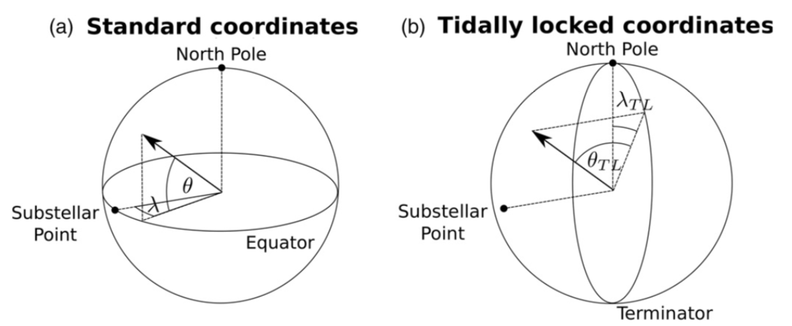

### Convert GCM output from standard/Earth-like coordinates into a tidally locked coordinate system.
These transformations are useful for plotting and anaylzing GCM simulations of slowly rotating tidally locked planets, i.e., Earth-like planets inside the habitable zone of small stars. For derivations and definitions, see Koll & Abbot (2015), Appendix B.

Adapted from Koll & Abbot 2015, Fig.1.

The resulting output looks like this.

Original code by dkoll.
Thanks to Huanzhou Yang for testing and improvements.

