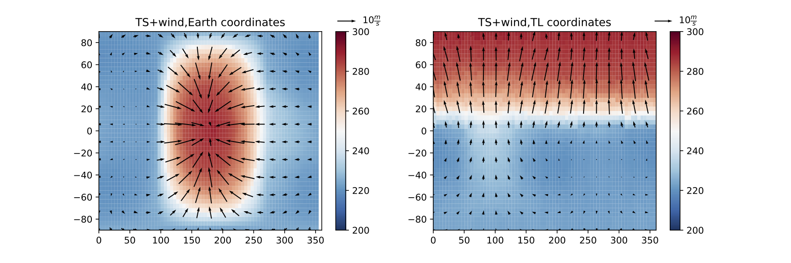

### Plotting routines for converting GCM output from standard/Earth-like coordinates into a tidally locked coordinate system.
See Koll & Abbot (2015), Appendix B.

Original code by dkoll.
Thanks to Huanzhou Yang for testing and improvements.

